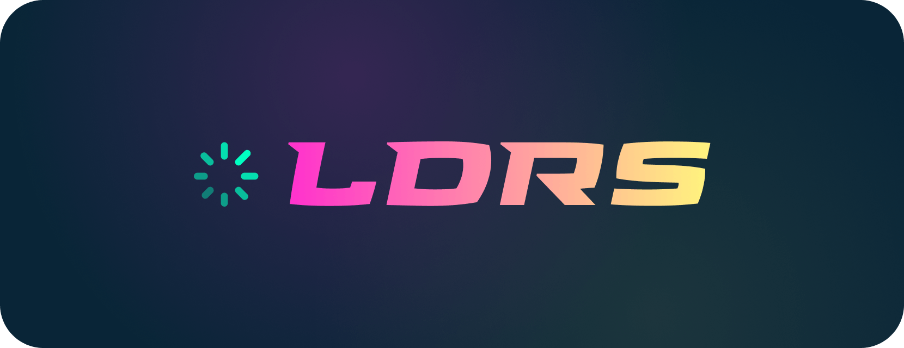

<div align="center">
  <a href="https://uiball.com/ldrs">
    <picture>
      <source media="(prefers-color-scheme: dark)" srcset="thumbnail-dark.png">
      <source media="(prefers-color-scheme: light)" srcset="thumbnail-light.png">
      
    </picture>
  </a>
</div>

# LDRS

Lightweight loaders & spinners for your next web project. The successor to @uiball/loaders. Rebuilt from the ground up using Typescript and web components, with 20 new loaders added for good measure.

- **44 types 🎨** : Unique enough to be interesting; simple enough to use in real-world projects
- **Powered by web components 🛠️** : Use with React, Vue, Svelte, Solid, plain HTML...
- **Customizable 🎚️** : Set the size, color, stroke width, and animation speed to match your design
- **Tiny 🐭** : No frameworks. No bloat. Dues-paying member of the iddy biddy bundle committee
- **Vanilla 🍦** : Only want the HTML & CSS? Just select a loader on [the website](https://uiball.com/ldrs) and go to `Source` -> `Raw`
- **Typed 🇹** : No one likes a squiggly red underline
- **No gifs 🎥** : Built with HTML, CSS and some lightweight SVG
- **Zero dependencies 🔗** : Zero worries

➠ Visit the [🌐 Website](https://uiball.com/ldrs) to see them all in action.

## Installation

**NPM**

```jsx
npm install ldrs
```

**Yarn**

```jsx
yarn add ldrs
```

## Getting Started

Import individual loader components. Use them wherever you like. The full list can be found on [the website](https://uiball.com/ldrs).

LDRS is built using web components ([here's why](/why-web-components.md)). Web components need to be registered or "defined" to work. Until registration they're just empty HTML elements that don't do anything. For convenience, LDRS come in two varieties: auto-defining and manually defined. Auto-defining elements are released as individual .js files that register themselves on import. Manually defined elements are named exports that come with a `register()` method.

```js
// Auto-defining
import 'ldrs/ring'

// Manually defined
import { ring } from 'ldrs'
ring.register()
```

You can rename your loader by passing a string to the `register()` method. Note that custom element names must contain a dash `-`.

```js
import { ring } from 'ldrs'
ring.register('my-precious')
```

```html
<my-precious color="black"></my-precious>
```

Here's a very simple example of using an auto-defining loader in a client-rendered React SPA:

```jsx
import 'ldrs/helix'

export default function PageSection({ isLoading }) {
  return (
    <div aria-live="polite" aria-busy={isLoading}>
      {isLoading && <l-helix></l-helix>}
    </div>
  )
}
```

## Frameworks

LDRS can only be run in a client-side environment, so they need to be excluded from SSR.

[📖 Next.js guide →](/framework-guides.md#nextjs)  
[📖 Astro guide →](/framework-guides.md#astro)  
[📖 Remix guide →](/framework-guides.md#remix)  
[📖 Gatsby guide →](/framework-guides.md#gatsby)

## Where's the old library?

It will continue to live on [npm](npmjs.com/package/@uiball/loaders) and [GitHub](https://github.com/GriffinJohnston/uiball-loaders-legacy), but is no longer maintained. That being said, upgrading to LDRS is pretty darn easy, and many of the loaders themselves have been improved. Give it a go why dontcha.

## Options

_Each loader has different defaults. You can see them on [the website](https://uiball.com/ldrs). Click on an individual loader and open the "source" sidebar._

### `size: number | string`

The size of the loader. Specifically, this defines the largest dimension (height or width) in pixels.

```jsx
<l-trefoil size="35" />
```

### `color: string`

Any valid CSS color value is accepted, so `#000000`, `red`, `hsla(13, 68%, 63%, .7)`, and `var(--my-custom-color)` are all a-okay.

```jsx
<l-trefoil color="papayawhip" />
```

### `speed: number | string`

The speed of the animation. Each loader uses this number a little differently (individual parts of a given loader might have different timings), but in general this number represents the duration of a single full animation loop in seconds, so smaller = faster. If you set speed to `0` or `Infinity` it will pause the animation.

```jsx
<l-trefoil speed="1.75" />
```

### `stroke: number | string`

The width / stroke in pixels of line-based loaders like `<l-waveform />` or `<l-zoomies />`.

```jsx
<l-trefoil stroke="3.5" />
```

### `stroke-length: number | string`

The length of the animated element of track-based loaders like `<l-ring-2 />` or `<l-infinity />`. Expressed as a fraction of total. Accepts a value from 0 to 1 (for example `.1` or `0.14159`).

```jsx
<l-trefoil stroke-length=".15" />
```

### `bg-opacity: number | string`

The opacity of background elements in loaders like `<l-reuleaux />` or `<l-hourglass />`. Accepts a value from 0 to 1 (for example `.1` or `0.618`).

```jsx
<l-trefoil bg-opacity=".1" />
```

## License

MIT
