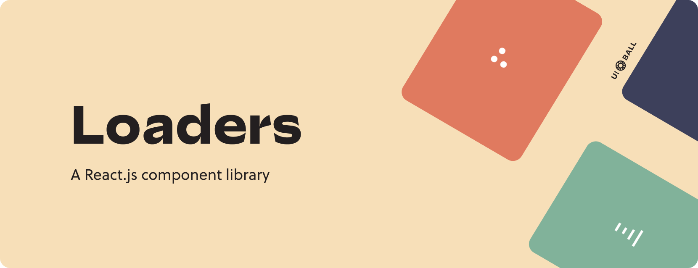

<div align="center">
  <a href="https://uiball.com/ldrs"></a>
</div>

# LDRS

Lightweight loaders & spinners for your next web project. The successor to @uiball/loaders. Rebuilt from the ground up with Typescript and Web Components. Plus 20 new loaders for good measure.

- **44 types 🎨** : Unique enough to be interesting; simple enough to use in real-world projects
- **Powered by web components 🛠️** : Use with React, Vue, Svelte, Solid, plain HTML... If it runs in a browser LDRS will work
- **Customizable 🎚️** : Set the size, color, stroke width, and animation speed to match your design
- **Tiny 🐭** : No frameworks. No bloat. Dues-paying member of the iddy biddy bundle committee
- **Typed 🇹** : No one likes a red underline
- **No gifs 🎥** : Built with HTML, CSS and some lightweight SVG
- **Zero dependencies 🔗** : Zero worries

➠ Visit the [🌐 Website](https://uiball.com/ldrs) to see them all in action.

## Installation

**NPM**

```jsx
npm install ldrs
```

**Yarn**

```jsx
yarn add ldrs
```

## Getting Started

Import individual loader components. Use them wherever you like. The full list can be found on [the website](https://uiball.com/ldrs).

```jsx
import { waveform } from 'ldrs'

export default function PageSection({ isLoading }) {
  return (
    <div aria-live="polite" aria-busy={isLoading}>
      {isLoading && <l-waveform></l-waveform>}
    </div>
  )
}
```

## SSR

Currently the one big drawback of web components is that they generally aren't compatible with server-side rendering (yet). That's why I think they are best used for "leaf" components at the moment. These loaders are a perfect example - they are a small, discrete bit of UI that contain no descendents. All this means is that you don't want to call .register() import the auto-registering version

## Platform Support

This is a pure ESM library, so no `require()`-ing from CommonJS. It makes use of CSS custom properties (CSS variables) and keyframe animations, which work great in all modern browsers. Internet Explorer is not supported, however.

**Next.js** versions less than 12 don't transpile ESM modules by default and will throw an error. If you are using Next v11.1, you can add support with an [experimental flag](https://nextjs.org/blog/next-11-1#es-modules-support). Otherwise you can add support with this package: https://www.npmjs.com/package/next-transpile-modules.

**Remix** requires an additional step to import pure ESM packages. See https://remix.run/docs/en/v1/pages/gotchas#importing-esm-packages.

TL;DR — add the following code to remix.config.js:

```
module.exports = { serverDependenciesToBundle: ["ldrs"] };
```

## Options

_Each loader has different defaults. You can see them on [the website](https://uiball.com/ldrs). Click on an individual loader and open the "source" sidebar._

### `size: number | string`

The size of the loader. Specifically, this defines the largest dimension (height or width) in pixels.

```jsx
<l-ring size="35" />
```

### `color: string`

Any valid CSS color value is accepted, so `#000000`, `red`, `hsla(13, 68%, 63%, .7)`, and `var(--my-custom-color)` are all a-okay.

```jsx
<l-ring color="papayawhip" />
```

### `speed: number | string`

The speed of the animation. Each loader uses this number a little differently (individual parts of a given loader might have different timings), but in general this number represents the duration of a single full animation loop in seconds, so smaller = faster. If you set speed to `0` or `Infinity` it will pause the animation.

```jsx
<l-ring speed="1.75" />
```

### `stroke: number | string`

The width / stroke in pixels of line-based loaders like `<l-waveform />` or `<l-zoomies />`.

```jsx
<l-ring stroke="3.5" />
```

### `bg-opacity: number | string`

The opacity of background elements in loaders like `<l-reuleaux />` or `<l-hourglass />`. Accepts a value from 0 to 1 (for example `.1` or `0.618`)

```jsx
<l-ring bg-opacity=".1" />
```

## License

MIT
